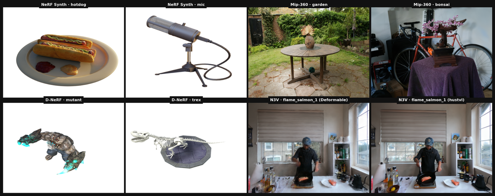
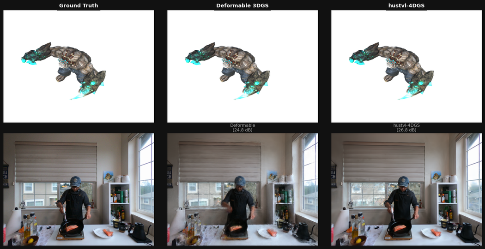

# Neural Rendering Comparison: 3D Gaussian Splatting Methods

  

A self-directed benchmarking study reproducing and comparing the **3DGS family of methods** across static and dynamic scene datasets. All training was run from scratch; results are compared against published paper numbers.

> Full exploration notes, paper deep-dives, and method derivations: [LEARNING_JOURNAL.md](LEARNING_JOURNAL.md)  
> Interactive analysis notebook: [notebooks/neural_rendering_comparison.ipynb](notebooks/neural_rendering_comparison.ipynb)

---

## Example Renders

Novel views synthesised by our trained models across all five datasets:



*Top row: static scenes — NeRF Synthetic (hotdog, mic) and Mip-NeRF 360 (garden, bonsai).  
Bottom row: dynamic scenes — D-NeRF Synthetic (mutant, t-rex) and N3V flame\_salmon\_1 (Deformable, hustvl-4DGS).*

### Method comparison: Ground Truth vs Deformable 3DGS vs hustvl-4DGS



*Left: ground-truth test frame. Centre: Deformable 3DGS render. Right: hustvl-4DGS render.  
Top: D-NeRF Synthetic — mutant scene (synthetic, monocular). Bottom: N3V flame\_salmon\_1 (real-world, 19 cameras).*

---

## Methods Compared

| Method | Key Idea | Venue | Code |
|---|---|---|---|
| **3D Gaussian Splatting** | Static 3D Gaussians, tile-based rasterizer | SIGGRAPH 2023 | [graphdeco-inria/gaussian-splatting](https://github.com/graphdeco-inria/gaussian-splatting) |
| **Deformable 3D Gaussians** | Canonical Gaussians + per-Gaussian deformation MLP | CVPR 2024 | [ingra14m/Deformable-3D-Gaussians](https://github.com/ingra14m/Deformable-3D-Gaussians) |
| **4DGaussians (hustvl)** | HexPlane 4D feature volume, query-and-deform | CVPR 2024 | [hustvl/4DGaussians](https://github.com/hustvl/4DGaussians) |
| **4D Gaussian Splatting (fudan)** | Gaussians lifted to 4D ellipsoids with temporal extent | ICLR 2024 | [fudan-zvg/4d-gaussian-splatting](https://github.com/fudan-zvg/4d-gaussian-splatting) |

### Conceptual Pipeline

```
3DGS (static)
  Input frames → COLMAP → 3D Gaussians → Tile rasterizer → Novel views

Deformable 3DGS
  Input frames → COLMAP → Canonical Gaussians ──┐
                                                  ├─ Deform MLP(xyz, t) → Δxyz, Δrot, Δscale
                                                  └─ Tile rasterizer → Novel views

4DGaussians / hustvl
  Input frames → COLMAP → 3D Gaussians ──┐
                                          ├─ HexPlane(xy,xz,yz,xt,yt,zt) → feature → deform offset
                                          └─ Tile rasterizer → Novel views

4D-GS / fudan
  Input frames → COLMAP → 4D Gaussians (mean_xyz, mean_t, Σ_4×4)
                                          ↓ Marginalise at timestamp t
                                          → 3D Gaussians → Tile rasterizer → Novel views
```

---

## Results at a Glance

### Static: NeRF Synthetic (8 scenes, 3DGS, 30k iters)

| Scene | PSNR ↑ | SSIM ↑ | LPIPS ↓ |
|---|---:|---:|---:|
| chair | 35.84 | 0.988 | 0.012 |
| drums | 26.16 | 0.955 | 0.036 |
| ficus | 34.89 | 0.987 | 0.012 |
| hotdog | 37.72 | 0.985 | 0.020 |
| lego | 35.91 | 0.983 | 0.015 |
| materials | 30.09 | 0.962 | 0.033 |
| mic | 36.12 | 0.992 | 0.006 |
| ship | 31.01 | 0.907 | 0.105 |
| **mean** | **33.47** | **0.970** | **0.030** |
| *paper (Kerbl et al., 2023)* | *33.32* | *0.971* | *0.038* |

### Static: Mip-NeRF 360 (7 scenes, 3DGS, 30k iters)

| Scene | PSNR ↑ | SSIM ↑ | LPIPS ↓ |
|---|---:|---:|---:|
| bicycle | 25.23 | 0.766 | 0.209 |
| bonsai | 32.05 | 0.942 | 0.204 |
| counter | 29.06 | 0.909 | 0.199 |
| garden | 27.56 | 0.868 | 0.106 |
| kitchen | 31.41 | 0.928 | 0.125 |
| room | 31.66 | 0.921 | 0.217 |
| stump | 26.65 | 0.772 | 0.215 |
| **mean** | **29.09** | **0.872** | **0.182** |

> Dataset: Barron et al. "Mip-NeRF 360: Unbounded Anti-Aliased Neural Radiance Fields," CVPR 2022.

### Dynamic: D-NeRF Synthetic (8 scenes × 3 methods)

| Scene | Deformable | hustvl-4DGS | fudan-4DGS | Best paper† |
|---|---:|---:|---:|---:|
| bouncingballs | **43.30** | 40.87 | 33.39 | 42.16 |
| hellwarrior | 32.17 | 28.83 | **34.75** | 42.66‡ |
| hook | **35.41** | 32.86 | 32.38 | 37.42 |
| jumpingjacks | **37.21** | 35.23 | 30.75 | 39.15 |
| lego | 25.08 | 25.02 | **25.56** | 33.07‡ |
| mutant | 38.92 | 37.87 | **38.92** | 43.81 |
| standup | 41.00 | 38.08 | **39.40** | 47.48 |
| trex | **38.38** | 34.29 | 29.90 | 38.10 |
| **mean** | **36.64** | 34.13 | 33.13 | 39.51/38.35/38.59 |
| **mean (excl. lego + hellwarrior)‡** | **39.31** | 36.53 | 34.12 | – |

† Best paper result per scene across all three methods' published numbers.  
‡ lego and hellwarrior exhibit known data quality issues in the publicly available D-NeRF dataset.

### Dynamic: N3V / flame_salmon_1 (19 cameras, cam00 hold-out)

| Method | PSNR ↑ | SSIM ↑ | LPIPS ↓ | Paper |
|---|---:|---:|---:|---:|
| Deformable | 24.78 | 0.881 | 0.202 | — |
| hustvl-4DGS | 26.79 | 0.871 | 0.215 | 27.96 |
| **fudan-4DGS** | **28.97** | **0.930** | **0.133** | 28.72 ✓ |

> Dataset: Li et al. "Neural 3D Video Synthesis from Multi-view Video," CVPR 2022.

### Dynamic: Custom Real-World Scene (scene_S004, 5 cameras, cam04 hold-out)

| Method | PSNR ↑ | SSIM ↑ | LPIPS ↓ |
|---|---:|---:|---:|
| 3DGS (static) | 12.17 | 0.456 | 0.645 |
| Deformable | 11.65 | 0.366 | 0.593 |
| hustvl-4DGS | 11.58 | 0.464 | 0.616 |
| **fudan-4DGS** | **11.97** | **0.499** | **0.616** |

All methods plateau near 12 dB — the bottleneck is sparse spatial coverage (3 training cameras), not the temporal model.

---

## Key Findings

1. **Our 3DGS implementation matches the paper.** Mean PSNR 33.47 vs. published 33.32 on NeRF Synthetic — the pipeline is correctly implemented.

2. **Deformable-3DGS wins on D-NeRF Synthetic.** The canonical-space + deformation-MLP factoring is a strong prior for *monocular* synthetic video, outperforming both 4D methods despite being architecturally simpler.

3. **fudan-4DGS wins on real-world multi-camera video.** It scores 28.97 PSNR on N3V (matching its published 28.72) and best SSIM on scene_S004 — the explicit temporal extent representation generalises better to high-framerate multi-view captures.

4. **Sparse cameras are the real bottleneck.** All dynamic methods score ≈11–12 dB on scene_S004. Switching methods provides marginal gains; capturing from more angles would help far more.

5. **lego and hellwarrior are outlier scenes.** Excluding them shifts Deformable's D-NeRF mean from 36.64 → 39.31 dB — much closer to the published 39.51. Both scenes have known data-quality issues in the public release.

---

## Datasets

| Dataset | Type | Scenes | Frames/scene | Cameras | Source |
|---|---|---:|---:|---:|---|
| NeRF Synthetic | Static, synthetic | 8 | 100 train / 200 test | 1 (virtual) | [nerf-datasets](https://github.com/bmild/nerf) |
| Mip-NeRF 360 | Static, real, unbounded | 7 | ~100–200 | 1 (handheld) | [nerf-360](https://jonbarron.info/mipnerf360/) |
| D-NeRF Synthetic | Dynamic, monocular | 8 | ~50–200 | 1 (virtual, moving) | [D-NeRF](https://github.com/albertpumarola/D-NeRF) |
| N3V / Plenoptic Video | Dynamic, multi-view | 6 | 300 @ 30 fps | 19 (Sony) | [Neural 3D Video](https://github.com/facebookresearch/Neural_3D_Video) |
| scene_S004 | Dynamic, real | 1 | ~300 | 5 (GoPro) | private |

---

## Reproducing Results

### Prerequisites

```bash
# CUDA 12+, gcc-12, conda
conda create -n neural-rendering python=3.10
conda activate neural-rendering
pip install torch==2.1.0 torchvision torchaudio --index-url https://download.pytorch.org/whl/cu121
```

Each method ships its own fork of the rasterizer under the same package name — they cannot share a conda environment. Three separate envs are required.

### 1. Clone third-party repos

```bash
# Static baseline
git clone --recursive https://github.com/graphdeco-inria/gaussian-splatting repos/gaussian-splatting

# Deformable 3DGS
git clone --recursive https://github.com/ingra14m/Deformable-3D-Gaussians repos/Deformable-3D-Gaussians

# hustvl 4DGaussians
git clone --recursive https://github.com/hustvl/4DGaussians repos/4DGaussians

# fudan 4D Gaussian Splatting
git clone --recursive https://github.com/fudan-zvg/4d-gaussian-splatting repos/4d-gaussian-splatting
```

### 2. Build rasterizers

The gcc-12 + CUDA_HOME setup is needed for all builds. See `scripts/activate_env.sh` for the exact env-var dance.

```bash
# ── env: neural-rendering (3DGS + Deformable) ───────────────────────────────
conda create -n neural-rendering python=3.10 -y && conda activate neural-rendering
pip install torch==2.1.0 torchvision --index-url https://download.pytorch.org/whl/cu121

export CUDA_HOME=~/cuda-home CC=/usr/bin/gcc-12 CXX=/usr/bin/g++-12
export PATH=$CUDA_HOME/bin:$PATH TORCH_CUDA_ARCH_LIST=8.6

pip install repos/Deformable-3D-Gaussians/submodules/depth-diff-gaussian-rasterization \
            repos/Deformable-3D-Gaussians/submodules/simple-knn \
            --no-build-isolation

# ── env: nr-4dgs-hustvl ──────────────────────────────────────────────────────
conda create -n nr-4dgs-hustvl python=3.10 -y && conda activate nr-4dgs-hustvl
pip install torch==2.1.0 torchvision --index-url https://download.pytorch.org/whl/cu121

pip install repos/4DGaussians/submodules/diff-gaussian-rasterization \
            repos/4DGaussians/submodules/simple-knn \
            --no-build-isolation

# ── env: nr-4dgs-fudan ───────────────────────────────────────────────────────
conda create -n nr-4dgs-fudan python=3.10 -y && conda activate nr-4dgs-fudan
pip install torch==2.1.0 torchvision --index-url https://download.pytorch.org/whl/cu121

pip install repos/4d-gaussian-splatting/submodules/diff-gaussian-rasterization \
            repos/4d-gaussian-splatting/submodules/simple-knn \
            --no-build-isolation
```

| Method | Conda env | Rasterizer |
|---|---|---|
| 3DGS + Deformable | `neural-rendering` | `depth-diff-gaussian-rasterization` |
| hustvl-4DGS | `nr-4dgs-hustvl` | `diff-gaussian-rasterization` (hustvl fork) |
| fudan-4DGS | `nr-4dgs-fudan` | `diff-gaussian-rasterization` (fudan fork) |

### 3. Static benchmarks

```bash
# NeRF Synthetic (all 8 scenes)
python scripts/12_benchmark_nerf_synthetic.py --scenes all

# Mip-NeRF 360 (all 7 scenes)
python scripts/14_benchmark_mipnerf360.py --scenes all
```

### 4. Dynamic benchmarks

```bash
# D-NeRF Synthetic — Deformable
python scripts/13_benchmark_dnerf.py --scenes all

# D-NeRF Synthetic — hustvl-4DGS
python scripts/15_benchmark_4dgs_hustvl.py --scenes all

# D-NeRF Synthetic — fudan-4DGS
python scripts/16_benchmark_4dgs_fudan.py --scenes all

# Aggregate dynamic comparison table
python scripts/17_compare_dynamic.py
```

### 5. Reproduce comparison table

```bash
cat experiments/benchmarks/dynamic_comparison.md
```

---

## Repository Structure

```
.
├── scripts/                      # All pipeline scripts (01–17)
│   ├── 01_extract_frames.py      # Video → frames
│   ├── 02_run_colmap.py          # SfM / camera poses
│   ├── 03_prepare_dataset.py     # Format for each method
│   ├── 05_train_static_3dgs.py   # 3DGS training
│   ├── 09_train_dynamic_4dgs.py  # Dynamic scene training
│   ├── 12_benchmark_nerf_synthetic.py
│   ├── 13_benchmark_dnerf.py
│   ├── 14_benchmark_mipnerf360.py
│   ├── 15_benchmark_4dgs_hustvl.py
│   ├── 16_benchmark_4dgs_fudan.py
│   └── 17_compare_dynamic.py     # 3-way comparison table
│
├── experiments/
│   ├── benchmarks/
│   │   ├── nerf_synthetic/       # Per-scene results.json
│   │   ├── mipnerf360/
│   │   ├── dnerf_synthetic/      # Deformable results
│   │   ├── dnerf_synthetic_4dgs_hustvl/
│   │   ├── dnerf_synthetic_4dgs_fudan/
│   │   └── dynamic_comparison.md # 3-way summary table
│   └── dynamic/
│       ├── scene_S004/           # Custom scene, all 3 methods
│       └── n3v/flame_salmon_1/   # N3V, all 3 methods
│
├── notebooks/
│   └── neural_rendering_comparison.ipynb  # Full analysis notebook
│
├── LEARNING_JOURNAL.md           # Theory, paper notes, derivations
└── README.md                     # This file
```

---

## References

1. B. Kerbl, G. Kopanas, T. Leimkühler, G. Drettakis. **3D Gaussian Splatting for Real-Time Radiance Field Rendering.** *ACM TOG / SIGGRAPH 2023.* [arXiv:2308.04079](https://arxiv.org/abs/2308.04079)

2. Z. Yang, X. Gao, W. Zhou, S. Jiao, Y. Zhang, X. Jin. **Deformable 3D Gaussians for High-Fidelity Monocular Dynamic Scene Reconstruction.** *CVPR 2024.* [arXiv:2309.13101](https://arxiv.org/abs/2309.13101)

3. G. Wu, T. Yi, J. Fang, L. Xie, X. Zhang, W. Wei, W. Liu, Q. Tian, X. Wang. **4D Gaussian Splatting for Real-Time Dynamic Scene Rendering.** *CVPR 2024.* [arXiv:2310.08528](https://arxiv.org/abs/2310.08528)

4. Z. Yang, H. Yang, Z. Pan, X. Zhu, L. Zhang. **Real-time Photorealistic Dynamic Scene Representation and Rendering with 4D Gaussian Splatting.** *ICLR 2024.* [arXiv:2310.10642](https://arxiv.org/abs/2310.10642)

5. T. Li, M. Slavcheva, M. Zollhoefer, S. Green, C. Lassner, C. Kim, T. Schmidt, S. Lovegrove, M. Goesele, R. Martin-Brualla, N. Kowdle. **Neural 3D Video Synthesis from Multi-view Video.** *CVPR 2022.* [arXiv:2103.02597](https://arxiv.org/abs/2103.02597)

6. B. Mildenhall, P. Srinivasan, M. Tancik, J. Barron, R. Ramamoorthi, R. Ng. **NeRF: Representing Scenes as Neural Radiance Fields for View Synthesis.** *ECCV 2020.* [arXiv:2003.08934](https://arxiv.org/abs/2003.08934)

7. J. Barron, B. Mildenhall, D. Verbin, P. Srinivasan, P. Hedman. **Mip-NeRF 360: Unbounded Anti-Aliased Neural Radiance Fields.** *CVPR 2022.* [arXiv:2111.12077](https://arxiv.org/abs/2111.12077)

8. A. Pumarola, E. Corona, G. Pons-Moll, F. Moreno-Noguer. **D-NeRF: Neural Radiance Fields for Dynamic Scenes.** *CVPR 2021.* [arXiv:2011.13961](https://arxiv.org/abs/2011.13961)
